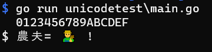
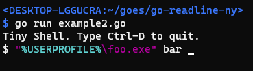

[](https://pkg.go.dev/github.com/nyaosorg/go-readline-ny)
[](https://goreportcard.com/report/github.com/nyaosorg/go-readline-ny)
[](https://github.com/nyaosorg/go-readline-ny/wiki)
[](https://github.com/nyaosorg/go-readline-ny/blob/master/LICENSE)

The New Yet another Readline for Go (go-readline-ny)
====================================================

**The New Yet another Readline for Go (go-readline-ny)** is a one-line input library for CUI applications written in Go that is extensible for different needs.  It has been running inside the command line shell "[NYAGOS]" for a long time.

[NYAGOS]: https://github.com/nyaosorg/nyagos

- Emacs-like key-bindings
- History
- Word Completion (file names, command names, or any names in given array)
- Syntax Highlighting
- Supported OS: Windows and Linux
- Suported Unicode (UTF8)
    - Surrogate-pair
    - Emoji (via clipboard)
    - Zero-Width-Joiner (via clipboard)
    - Variation Selector (via clipboard pasted by Ctrl-Y)
- Add-Ons:
    - [SKK] (Japanese method editor)
    - [Multi-lines Editing][go-multiline-ny]
- MIT License

[SKK]: https://github.com/nyaosorg/go-readline-skk
[go-multiline-ny]: https://github.com/hymkor/go-multiline-ny





[example1.go](./examples/example1.go)
----------

The most simple sample.

```examples/example1.go
package main

import (
    "context"
    "fmt"

    "github.com/nyaosorg/go-readline-ny"
)

func main() {
    var editor readline.Editor
    text, err := editor.ReadLine(context.Background())
    if err != nil {
        fmt.Printf("ERR=%s\n", err.Error())
    } else {
        fmt.Printf("TEXT=%s\n", text)
    }
}
```

If the target platform includes Windows, you have to import and use [go-colorable](https://github.com/mattn/go-colorable) like example2.go .

[example2.go](./examples/example2.go)
-----------

Tiny Shell. This is a sample of prompt change, colorization, filename completion and history browsing.

```examples/example2.go
package main

import (
    "context"
    "fmt"
    "io"
    "os"
    "os/exec"
    "strings"

    "github.com/mattn/go-colorable"

    "github.com/nyaosorg/go-readline-ny"
    "github.com/nyaosorg/go-readline-ny/coloring"
    "github.com/nyaosorg/go-readline-ny/completion"
    "github.com/nyaosorg/go-readline-ny/keys"
    "github.com/nyaosorg/go-readline-ny/simplehistory"
)

func main() {
    history := simplehistory.New()

    editor := &readline.Editor{
        PromptWriter: func(w io.Writer) (int, error) {
            return io.WriteString(w, "\x1B[1;36m$ \x1B[0m") // print `$ ` with cyan
        },
        Writer:         colorable.NewColorableStdout(),
        History:        history,
        Coloring:       &coloring.VimBatch{},
        HistoryCycling: true,
    }

    editor.BindKey(keys.CtrlI, completion.CmdCompletionOrList{
        Completion: completion.File{},
    })
    // If you do not want to list files with double-tab-key,
    // use `CmdCompletion` instead of `CmdCompletionOrList`

    fmt.Println("Tiny Shell. Type Ctrl-D to quit.")
    for {
        text, err := editor.ReadLine(context.Background())

        if err != nil {
            fmt.Printf("ERR=%s\n", err.Error())
            return
        }

        fields := strings.Fields(text)
        if len(fields) <= 0 {
            continue
        }
        cmd := exec.Command(fields[0], fields[1:]...)
        cmd.Stdout = os.Stdout
        cmd.Stderr = os.Stderr
        cmd.Stdin = os.Stdin

        cmd.Run()

        history.Add(text)
    }
}
```

example3.go
------------

- [example3.go](./examples/example3.go)

This is a sample to change key-bindings to diamond cursor.

example4.go
------------

- [example4.go](./examples/example4.go)

This is a sample that implements the function to start the text editor defined by the environment variable EDITOR and import the edited contents when the ESCAPE key is pressed.
